# digitalboost-wordpress-site
## Setup Git repository
- [Login to your github account]("http://github.com") and click on New.
- Provide the necessary details like the repository name and check the readme file option. See image below

    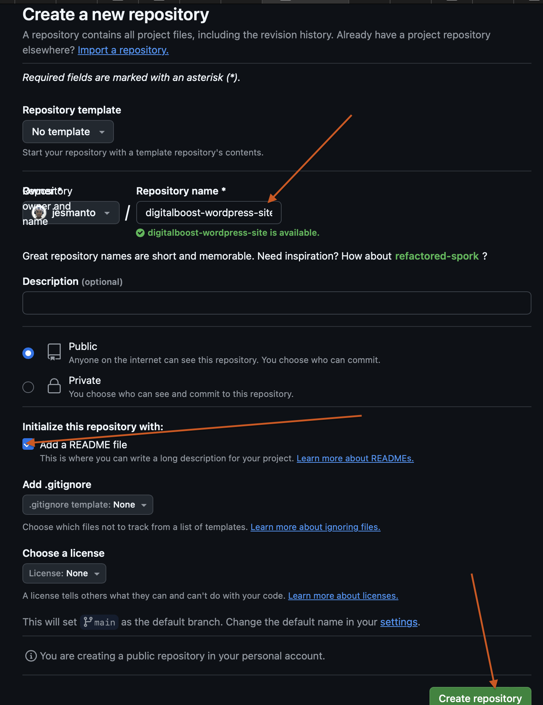

- After suppying the necessary information, click on `Create Repository`. 
- On the repository page, copy out the repository link. You will need it to clone the repository to your local machine. See image below

    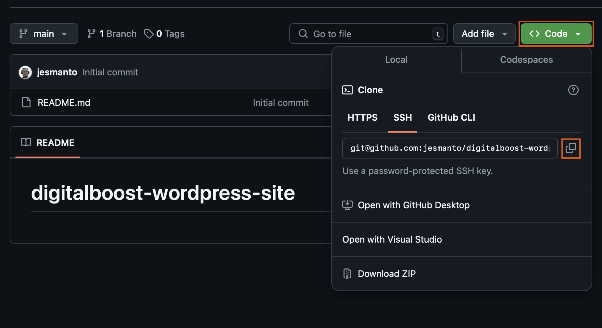

- On you local machine, open your terminal.
- Navigate to the directory you desire to clone your repository.
- Use the clone command to clone your repo. In my case I used `git clone git@github.com:jesmanto/digitalboost-wordpress-site.git`. See image below.

    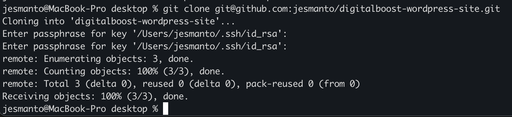

Now Git has been successfully setup.

## Create VPC
- Login to your AWS console
- Click on services and search for VPC

    
- Click on VPC and click on `Create VPC`
- Provide the necessaery information and click on `Create VPC`

    

## Create Internet Gateway
- On the VPC page, click on **Internet Gateways**
- Click on `Create internet gateways`

    

- Supply the necessary information and create IGW

    

- Attach the internet gateway to the VPC

    

## Create NAT Gateway
- On the VPC page, click on **Elastic IPs**
- Click on `Allocat Elastic IP Address`
- Click `Allocate` to allocate an Elastic IP
- On the VPC page, click on **NAT Gateway**
- Click on `Create NAT Gateway`
    - Provide a name
    - Select the public subnet under the subnet option
    - Select the just allocated elastic IP
    - Click on `Create NAT Gateway`
    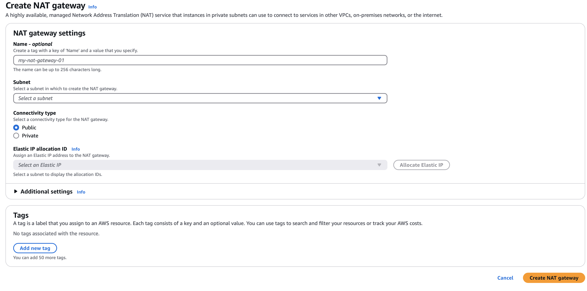

## Create Subnets
- On the same VPC page, click on subnets
- Click on `Create subnets`

    

- Select the VPC
- Provide the name of the subnet
- Select an availability zone
- Define the IP address range
- Click on `Create subnet`

    

- Repeat this process to create other public and private subnets.

## Create Route Tables
Route tables are like traffic directors. They direct traffics coming in and out of the subnet according to set rules.
- On the VPC page, click on **Route tables**
- Click on `Create route tables`
    
- Supply the necessary information needed by seleting a VPC and givenit a name
- Click on `Create route table`
- Once, you are done with that, its's time to tell the route table where to direct traffic.

### Create Routes
#### For public route table
- On the `Details` tab of your route table, click on **Edit routes**

- At this point the public route table only has SSH (port 22) access, no internet access (port 80).
- To enable internet access in the public subnets, click on **Add route**
- Select `HTTP` as destination
- Select the new IGW as the target
- Save changes


#### For private route table
The steps are the same with that of public route table, the difference is in the target. Since it's private, we only want to have access to the internet, but dont want the internet to have access to our server. Hence, we set the target to a NAT gateway which we will create soon.

### Subnet Association
Click on the `Subnet Association` tab and click on `Edit subnet association`.


Associate all public subnets to the public route table and private subnets to the private route table.


## Launch EC2 Instance
To do this we will be using a shell script with AWS CLI
- Create a file script `launch-server.sh`
- Verify if AWS CLI is installed
- Verify if AWS_PROFILE has been configured
- Launch ec2 instance by providing the necessary details, including the subnet ID of our private subnet.

>See Script below:


- Give user execution permission by running ```chmod +x launch-server.sh```
- Run your script

- Create a private server in the private subnet.
- Create a Bastion host in the public subnet, which serves as the only entry point to the private server.
- Add another security group rule to the Bastion server when creating the instance, to enable http requests.


## Connect to Private instance
- Go to AWS console and navigate to your EC2 instances, you will find the new instances we just created.
- Check the instance box and click connect.

- SSH into the instance using Bastion Host because the main server lives in a private subnet and cannot be accessed from outside the VPC
>A bastion host is an instance created in the public subnet, that has access to and fro the internet
- Using our script, change the `subnet-id` to the id of your public subnet.
- Run the script to create the baston
- Copy out the text in the keypair file
- SSH into the Bastion
- Create a file and paste the copied text


- Go to AWS console and copy the private IP address of the private instance


- SSH into the private server using the private IP


## Install Wordpress
- Change to root user `sudo su`
- Create the html directory and mount the efs to it
    - ```mkdir -p /var/www/html```
    - Go to AWS console
    - search for EFS
    - Create EFS and select your VPC
    - Connect the EFS to the Security group attach to the wordpress server
    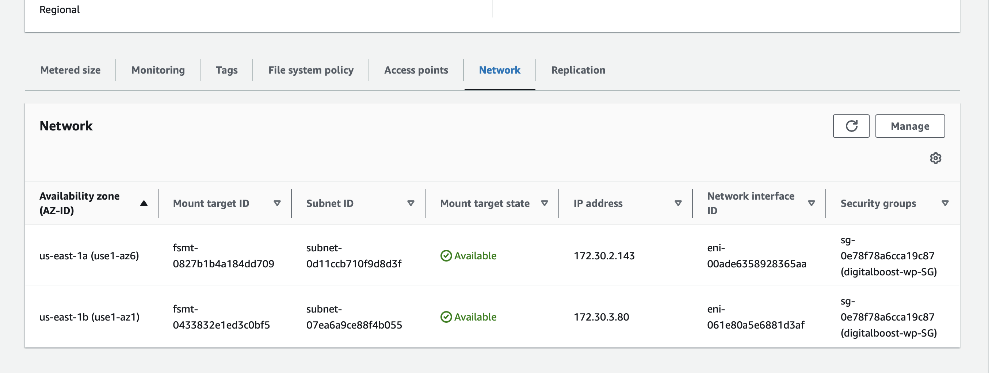
    - Add another rule to the security group to accept NFS connection for the same source.
    - Mount the File Sytem by clicking on `Attach`.
    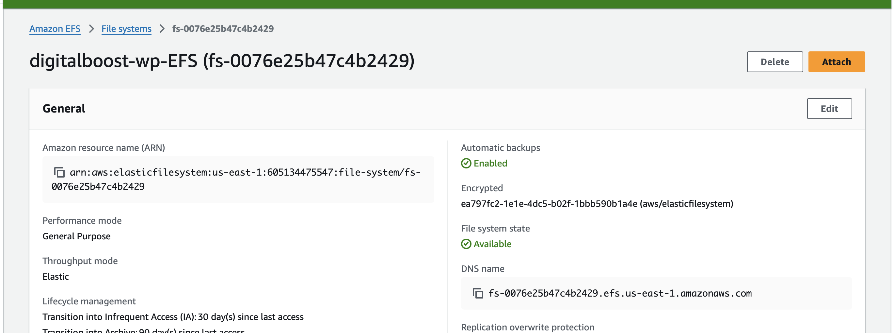
    - Copy and run the command on you terminal
    ```
    sudo mount -t nfs4 -o nfsvers=4.1,rsize=1048576,wsize=1048576,hard,timeo=600,retrans=2,noresvport fs-03c9b3354880b36a6.efs.us-east-1.amazonaws.com:/ /var/www/html
    ```
- Install Apache
    ```
    sudo yum install -y httpd httpd-tools mod_ssl
    ```
    - Enable server
        ```
        sudo systemctl enable httpd
        ```
    - Start the server
        ```
        sudo systemctl start httpd
        ```
- Install php 7.4
    ```
    sudo amazon-linux-extras enable php7.4
    sudo yum clean metadata
    sudo yum install php php-common php-pear -y
    sudo yum install php-{cgi,curl,mbstring,gd,mysqlnd,gettext,json,xml,fpm,intl,zip} -y
    ```
- install mysql5.7
    ```
    sudo rpm -Uvh https://dev.mysql.com/get/mysql57-community-release-el7-11.noarch.rpm
    sudo rpm --import https://repo.mysql.com/RPM-GPG-KEY-mysql-2022
    sudo yum install mysql-community-server -y
    sudo systemctl enable mysqld
    sudo systemctl start mysqld
    ```
- Set Permissions
    ```
    sudo usermod -a -G apache ec2-user
    sudo chown -R ec2-user:apache /var/www
    sudo chmod 2775 /var/www && find /var/www -type d -exec sudo chmod 2775 {} \;
    sudo find /var/www -type f -exec sudo chmod 0664 {} \;
    chown apache:apache -R /var/www/html 
    ```
- Download wordpress and move wordpress folder to `/var/www/html`
    ```
    wget https://wordpress.org/latest.tar.gz
    tar -xzf latest.tar.gz
    cp -r wordpress/* /var/www/html/
    ```
- Create the wp-config file
    ```
    cp /var/www/html/wp-config-sample.php /var/www/html/wp-config.php
    ```
- Edit the wp-config.php file
    ```
    nano /var/www/html/wp-config.php
    ```
- Restart the server
    ```
    service httpd restart
    ```

## AWS MySQL RDS Setup
### Create an Amazon RDS instance with MySQL engine
- On AWS console, search for RDS
- On RDS page, click on `Databases`
- Click `Create database`
- Select `Standard create`. This will enable you to customize your RDS.
- Choose `MySQL` under engine options

- Select a template. For me, `Free Tier`.
- Add database credentials

- Create new security group for your DB and select availability zone
- Leave every other configurations the way they are and create datatabase
>Give it some time to create

**When it is done creating,**

- Click on the DB identifier

- On the `Connectivity & security tab`, Locate seccurity and click on the security group

- Edit inbound rules, `and Add rule`
- Select `MYSQL/Aurora` as the type
- This will automatically open port `3306`
- Select `0.0.0.0\0` as CIDR block


>Store the Datatbase endpoint and credentials somewhere and open you terminal

- Head over to the terminal and run the following command
    ```
    mysql -h [Endpoint] -P 3306 -u [Username] -p[password]
    ```

## Access the Wordpress site
Because our private EC2 instance does have a public IP Address, even though the bastion host has one, the only way we can access the website is by using a load balancer.

### Create an Application Load Balancer
>Make sure your instances are on running state
- Go to AWS console
- In the EC2 page, locate `Load Balancing`
- Click on `Target Groups`
- Click on `Create target group`
    - Under `Basic Configuration`, select `Instances`
    - Provide a name for the target group
    - Select your VPC
    - Click `Next` and Select the instance containing the wordpress site for the list of running instances.
    - Finally, click on `Create target group`.
- Create a security group for the load balancer.
    - Click on `Security Groups`
    - Click on `Create security group`
    - Provide the name and description
    - Select your preferred VPC
    - Add a new inbound rule to accept traffic from anywhere
        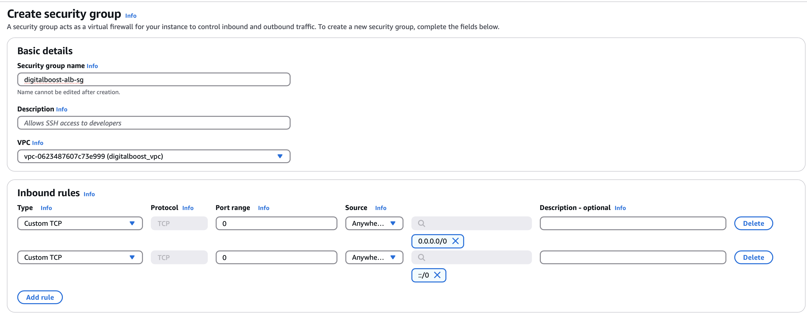
- Finally, Create a Load Balancer
    - On the same EC2 page, select `Load Balancers` from the left side
    - Click on `Create a load balancer`
    - Under Load balancer types, select `Application Load Balancer`
    - Provide a name for the Application Load Balancer
    - Select your preferred VPC
    - Under availability zones, select the zones and select the public subnets in the various availability zones.
    - Select the security group you created earlier
    - Under `Listeners and routing`, select the target group you created
    - Click `Create load balancer`.

### Allow traffic from the load balancer
- Click on `Instances`
- Click on the wordpress instance
- Click on Security tab
- Click on the security group 
    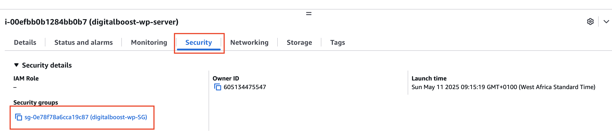
- Edit Inbound rules and add a new rule to allow port 80 traffic from the application load balancer by selecting the application load balancer security group as the source.
- Go back to the target group and ensure that all targets are healthy
    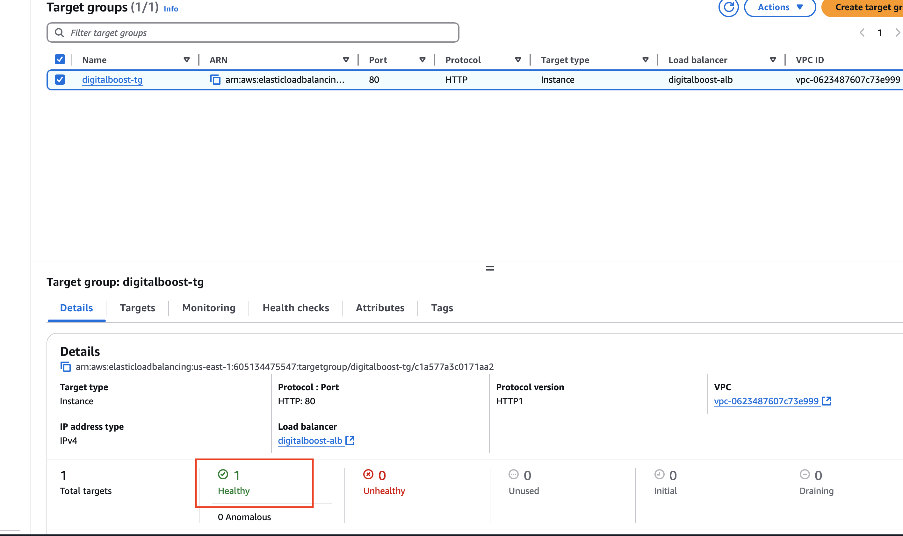

### Launch Wordpress site
- Go back to load balancers
- Select the just created application load balancer
- Copy the DNS name
    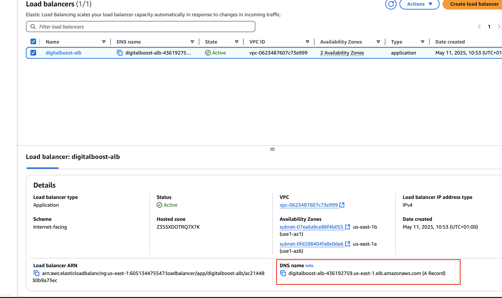
- Head over to your browser and paste the dns name
    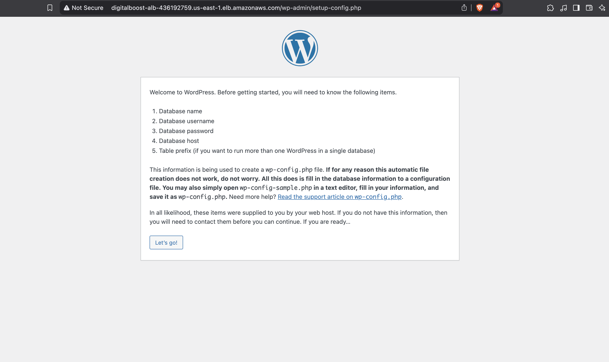

>HURRAY!!! My Wordpress site is live

NEXT, 
    - Click on `Let's go!` to configure the database.

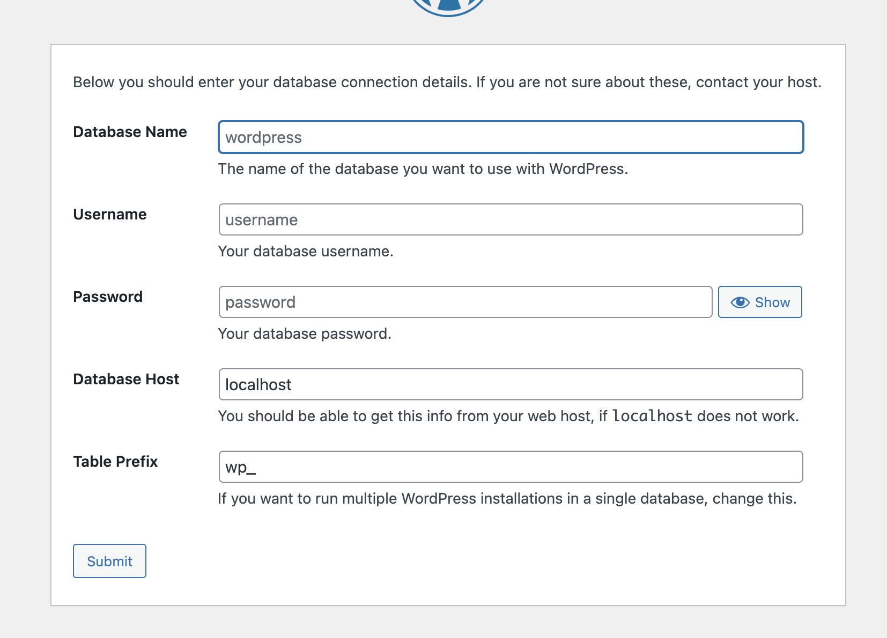

### Database Configuration
- Fill in the necessary information on the form provide above
- Click on `submit`
- If you enter the credentials correctly, you should get a congratulations.
    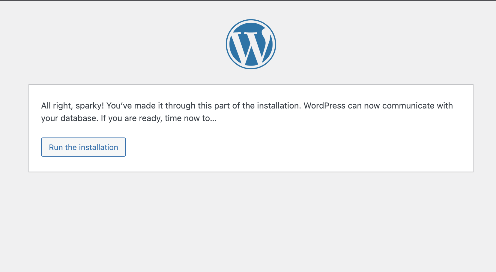
- Click on `Run the Installation` button.
- Fill in the necessary information
    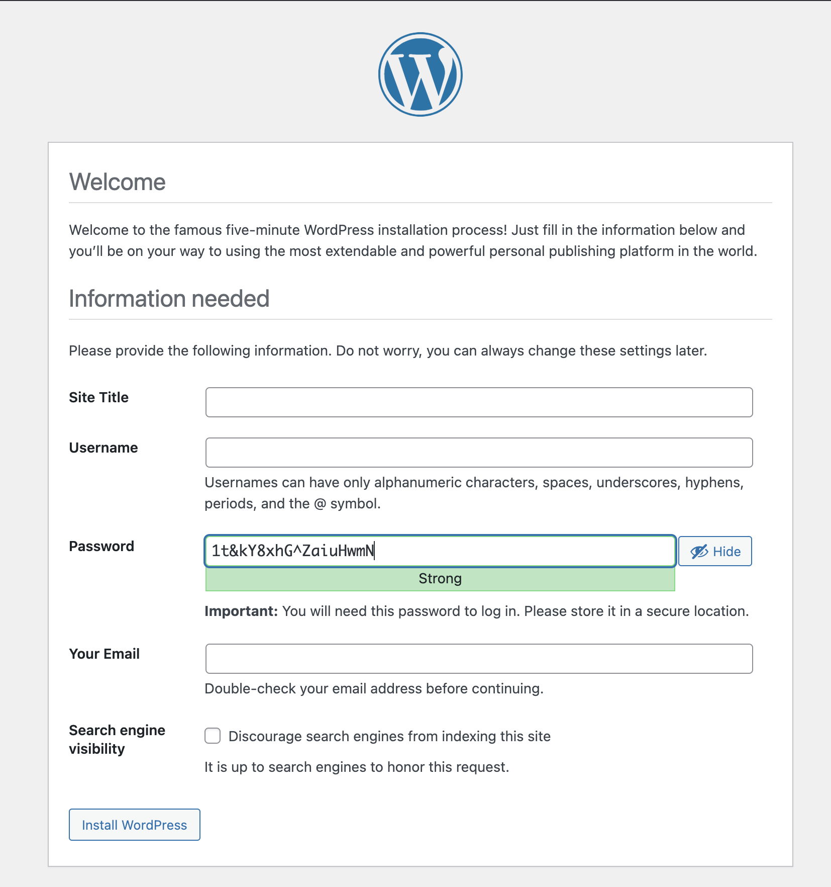

### Digital Boost Wordpress site is ready
    
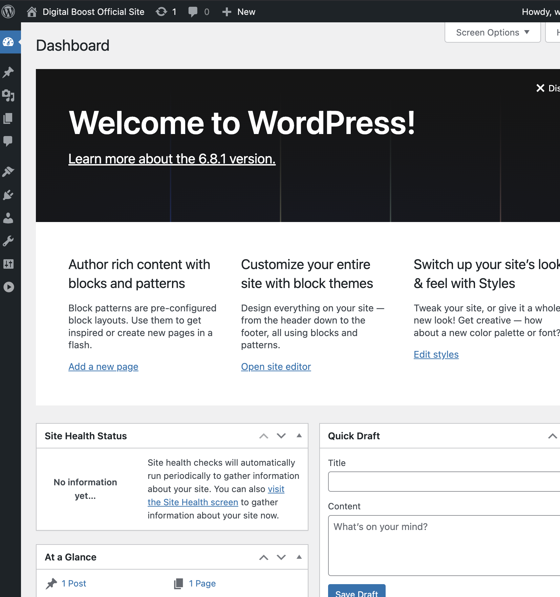

## Auto-Scaling Group
The final step of our setup is to auto-scale our instances in case of too much traffic. The steps are as follows.

- Go to AWS EC2 console
- On the bottom left, click on `Auto Scaling Groups`
- Click on `Create Auto Scaling Group`
- Provide the name
- Under **Launch Template**, click on `Create a launch template`
    - Click on `Quick Start` tab
    - Configure the instance to be created each time there's an auto-scaling
    - Do not select a key-pair and subnet.
    - Add your Bootstrap script
    - Create Launch Template
- Back to the auto-scaling group page
- Select the just-created launch template
- Click Next
- Select your VPC
- Select your private subnets under availability zones.
- Click Next
- Select your existing load balancer and check the first box in the health check section.
    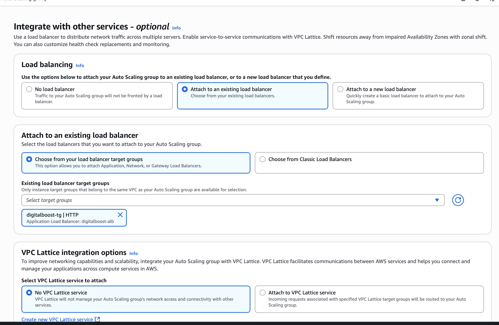
- Click `Next`
- Choose your desired capacity under the group size
- Under scaling, specify minimum and maximum desired capacity
- Click `Next`
- You can also add a notification channel by clicking on `Add notification`
    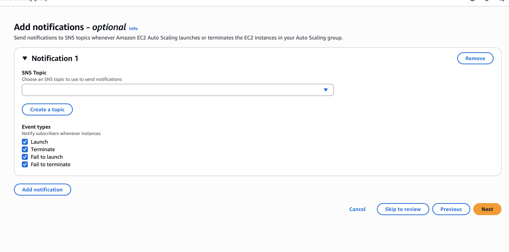
- Click `Next`
- Add necessary tags and review
- Create Auto-scaling group

- Go to auto scaling page and select the auto scaling group you recently created.
- Ensure the instances are healthy
    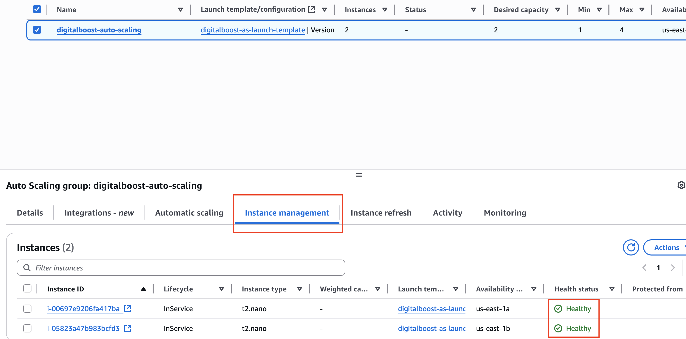

> At this point, you can terminate the main wordpress instance.

GOOD JOB!!!

## Challenges Faced.
- I faced challenges with setting up a bastion host and allowing access to the wordpress private server throught the bastion host. I did not know how to use the key-pairs and how to add rules to the security channel of an instance that has no public IP
- I faced some challenges when installing php with a deprecated `amazon-linux-extras` command.
- I faced challenges with mysql RDS setup. My issues were linking it with the application load balancer, hence I was getting a 503 exception from the target group health cheks.
- I face problems trying to create Auto-Scaling group.

## How I solved the challenges
- I utilized online resources like chatGpt, youtube, github repos, stackoverflow, and other random resources online.
- I reached out to Darey.io technical team, who gave me a run down of how to go about the project.

## Best Practices
- Security is key, that is why I made use of a bastion host, which stands as the only channel through which the main server can be accessed.
- Auto Scaling Groups help in adding more instances to the one available to curtail traffic jam on the system
- Load balancing is important to ensure proper distribution of traffic to available targets, in order not to overwhelm the server.